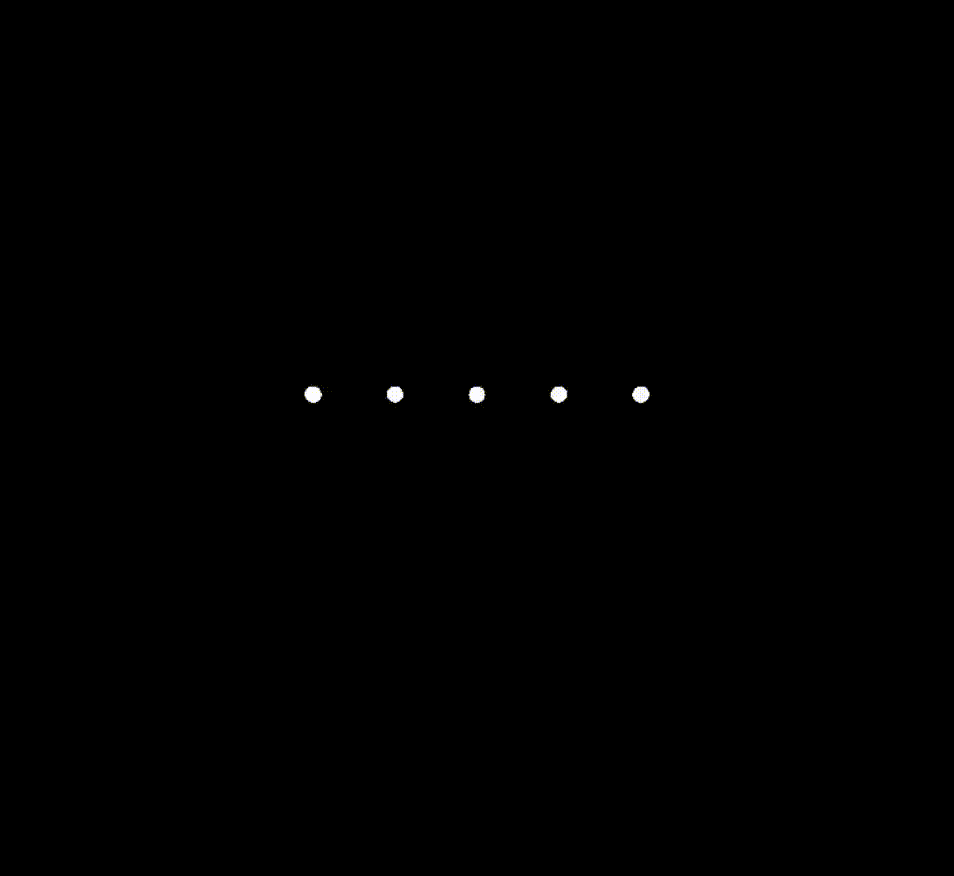

# Particles 

A lightweight physics engine for powering particle systems in threejs.  

## Quick start

```bash
npm install ptcl
```

## Example

This code creates an animation of a particle being thrown up in the air and falling back down due to gravity.

```ts
import * as THREE from 'three';
import { Particle, ParticleWorld, ParticleGravity } from 'ptcl';
    
const camera = new THREE.PerspectiveCamera( 75, window.innerWidth / window.innerHeight, 0.1, 1000 );
camera.position.z = 10;
        
const scene = new THREE.Scene();
    
let clock = new THREE.Clock();
    
const world = new ParticleWorld();
const p = new Particle(new THREE.Vector3());
p.velocity = new THREE.Vector3(0,10,0);
world.registry.add(p,new ParticleGravity(new THREE.Vector3(0,-10,0)));
world.addParticle(p);

const material = new THREE.MeshBasicMaterial();
const geometry = new THREE.SphereGeometry(0.1);
const s = new THREE.Mesh(geometry, material);
p.mesh = s;
scene.add(s);

const renderer = new THREE.WebGLRenderer({canvas: document.getElementById("game")});
renderer.setSize( window.innerWidth, window.innerHeight );

function animate() {
  requestAnimationFrame(animate);

  world.startFrame();
  world.runPhysics(clock.getDelta());
  world.updateGraphics();
  
  renderer.render(scene, camera);
}
animate();
```
This should be what you get:



## Running tests

```bash
npm run tests
```
